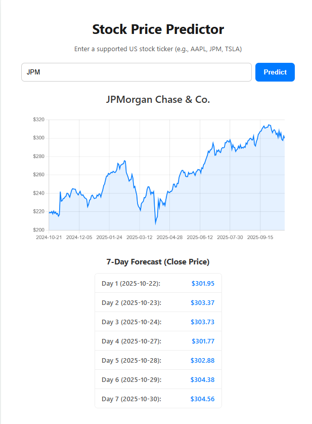

# AI Stock Price Predictor (Multivariate LSTM) 📈

This is a full-stack, decoupled web application that predicts the next **7 days** of closing stock prices using a **Multivariate Long Short-Term Memory (LSTM)** neural network.

The model uses the last 60 days of **Open, High, Low, Close, and Volume** data to forecast the future closing prices for 48 major US stocks.

This project showcases skills in:
* **Backend Development:** Python, Flask API
* **Deep Learning:** TensorFlow, Keras (LSTM Model Building & Training)
* **Data Science:** Pandas, NumPy, Scikit-learn (Data Processing, Scaling)
* **Frontend Development:** HTML, CSS, JavaScript (Chart.js for visualization)
* **API Integration:** Fetching live data via `yfinance`.
* **Version Control:** Using **Git LFS** to manage large model files.

---

## 🚀 Features

* **Full-Stack Architecture:** Decoupled JS frontend consumes a Python/Flask backend API.
* **Advanced AI Model:** Uses a Multivariate LSTM trained on 5 features (O, H, L, C, V) per stock.
* **7-Day Forecasting:** Predicts a sequence of the next 7 trading days' closing prices.
* **Dynamic Model Loading:** Backend dynamically loads the specific `.keras` model and `MinMaxScaler` for the requested stock.
* **Data Visualization:** Displays a 1-year historical price chart using Chart.js.
* **Includes Pre-trained Models:** 48 `.keras` models and scalers are included via Git LFS, so you don't need to run the lengthy training script.

---

## 🛠️ Tech Stack

* **Backend:** Python 3.x, Flask, TensorFlow, Keras, Scikit-learn, Pandas, NumPy, yfinance, joblib
* **Frontend:** HTML5, CSS3, JavaScript (ES6+), Chart.js
* **Core Concepts:** REST API, Deep Learning, Time Series Forecasting, Multivariate LSTM, Data Normalization, Git LFS

---
